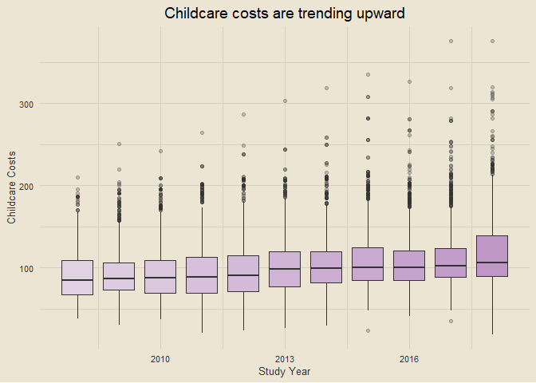
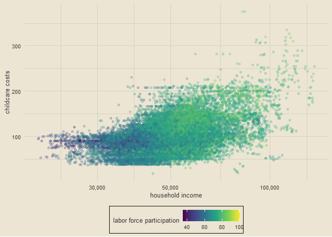
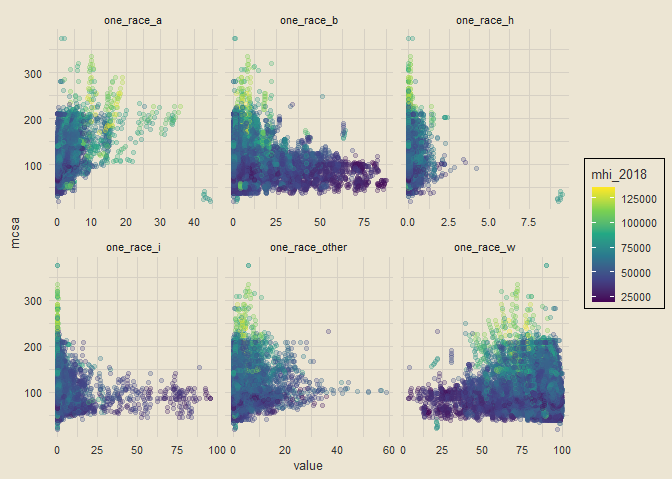
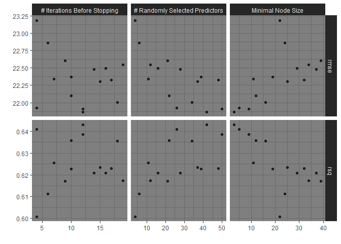
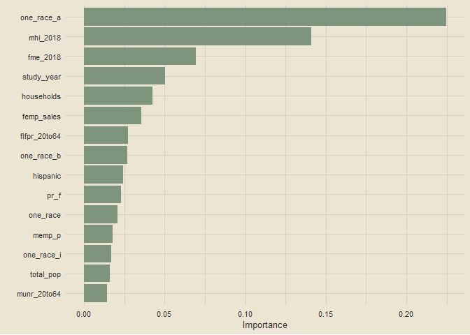

Predict childcare costs in US counties with xgboost and early stopping
================

### Setup

``` r
library(tidyverse)
library(tidymodels)
library(tvthemes)
library(janitor)
library(patchwork)
library(vip)

theme_custom = theme_avatar() +
  theme(plot.title = element_text(hjust = 0.5),
        plot.subtitle = element_text(hjust = 0.5, size = 9, vjust = 2.5, face = "italic"),
        panel.grid.major = element_line(linewidth = 0.5, colour = "#D6D0C4"),
        panel.grid.minor = element_line(linewidth = 0.5, colour = "#D6D0C4"))

theme_set(theme_custom)
options(scipen = 999)
```

### Data Import

``` r
link1 = "https://raw.githubusercontent.com/rfordatascience/"
link2 = "tidytuesday/master/data/2023/2023-05-09/childcare_costs.csv"
link = paste0(link1, link2) # doing this so it doesn't take up multiple lines on my screen
rm(link1, link2)
df = read_csv(link, col_types = cols())
paste0("Data dimensions: ", nrow(df), " rows, ", ncol(df), " columns")
```

    ## [1] "Data dimensions: 34567 rows, 61 columns"

### Exploring Data

``` r
df |>
  filter(!is.na(mcsa)) |>
  ggplot(aes(study_year, mcsa, group = study_year)) +
  geom_boxplot(aes(fill = study_year), outlier.alpha = 0.25, show.legend = F) +
  scale_fill_gradient(low = "#E0D2E3", high = "#BF97C7") +
  labs(x = "Study Year", y = "Childcare Costs", title = "Childcare costs are trending upward")
```

<!-- -->

``` r
df |>
  filter(!is.na(mcsa)) |>
  ggplot(aes(mhi_2018, mcsa)) +
  geom_point(aes(color = flfpr_20to64), alpha = 0.25) +
  scale_x_log10(labels = comma) +
  scale_color_viridis_c() +
  theme(legend.position = "bottom") +
  labs(x = "household income", y = "childcare costs", col = "labor force participation")
```

<!-- -->

``` r
df |>
  filter(!is.na(mcsa)) |>
  select(mcsa, mhi_2018, starts_with("one_race")) |>
  select(-one_race) |>
  pivot_longer(starts_with("one_race")) |>
  ggplot(aes(value, mcsa)) +
  geom_point(aes(col = mhi_2018), alpha = 0.25) +
  facet_wrap(vars(name), scales = "free_x") +
  scale_color_viridis_c() +
  theme(legend.position = "right")
```

<!-- -->

### Building a Model

``` r
split = df |>
  select(-matches("^mc_|^mf")) |>
  select(-county_fips_code) |>
  na.omit() |>
  initial_split(strata = mcsa)

train = training(split)
test = testing(split)
vset = validation_split(train)

xgb_spec = boost_tree(trees = 500, min_n = tune(), mtry = tune(),
                      stop_iter = tune(), learn_rate = 0.01) |>
  set_engine("xgboost", validation = 0.25) |> # 20% of training data from validation set
  set_mode("regression")

xgb_wf = workflow(mcsa ~ ., xgb_spec)

# turn on parallel procession
doParallel::registerDoParallel()
xgb_rs = tune_grid(xgb_wf, vset, grid = 15)
```

    ## i Creating pre-processing data to finalize unknown parameter: mtry

``` r
xgb_rs
```

    ## # Tuning results
    ## # Validation Set Split (0.75/0.25)  
    ## # A tibble: 1 × 4
    ##   splits               id         .metrics          .notes          
    ##   <list>               <chr>      <list>            <list>          
    ## 1 <split [13269/4424]> validation <tibble [30 × 7]> <tibble [0 × 3]>

### Evaluating Results

``` r
autoplot(xgb_rs) +
  theme_dark()
```

<!-- -->

``` r
show_best(xgb_rs, "rmse")
```

    ## # A tibble: 5 × 9
    ##    mtry min_n stop_iter .metric .estimator  mean     n std_err .config          
    ##   <int> <int>     <int> <chr>   <chr>      <dbl> <int>   <dbl> <chr>            
    ## 1    42     3        12 rmse    standard    21.9     1      NA Preprocessor1_Mo…
    ## 2    50     9        12 rmse    standard    21.9     1      NA Preprocessor1_Mo…
    ## 3    26     5         4 rmse    standard    21.9     1      NA Preprocessor1_Mo…
    ## 4    34    16        18 rmse    standard    22.0     1      NA Preprocessor1_Mo…
    ## 5    22    12        10 rmse    standard    22.1     1      NA Preprocessor1_Mo…

``` r
childcare_fit = xgb_wf |>
  finalize_workflow(select_best(xgb_rs, "rmse")) |>
  last_fit(split)

collect_metrics(childcare_fit)
```

    ## # A tibble: 2 × 4
    ##   .metric .estimator .estimate .config             
    ##   <chr>   <chr>          <dbl> <chr>               
    ## 1 rmse    standard      21.0   Preprocessor1_Model1
    ## 2 rsq     standard       0.622 Preprocessor1_Model1

### Variable Importance

``` r
extract_workflow(childcare_fit) |>
  extract_fit_parsnip() |>
  vip(num_features = 15, aesthetics = list(fill = "#7E947D"))
```

<!-- -->

### Setting Up Model for Deployment

``` r
library(vetiver)
```

    ## 
    ## Attaching package: 'vetiver'

    ## The following object is masked from 'package:tune':
    ## 
    ##     load_pkgs

``` r
v = extract_workflow(childcare_fit) |>
  vetiver_model("childcare-costs-xgb")

v
```

    ## 
    ## ── childcare-costs-xgb ─ <bundled_workflow> model for deployment 
    ## A xgboost regression modeling workflow using 52 features
